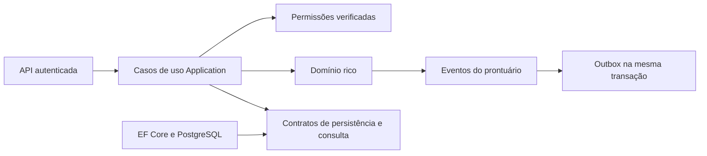

# Camada Application

A Application coordena os casos de uso: identifica empresa e usuário, autoriza a operação, carrega os agregados, chama os métodos do domínio e grava a unidade de trabalho. Ela não depende de EF Core, Npgsql, ASP.NET ou da implementação de infraestrutura. Sua única dependência adicional é a abstração de injeção de dependências.



## Casos de uso

- `ChamadoAplicacao`: abrir, aceitar, assumir, iniciar atendimento, trocar responsável, solicitar informações, responder como solicitante/equipe, registrar nota interna, alterar prioridade/categoria/visibilidade, transferir, resolver, confirmar ou rejeitar solução, reabrir, cancelar, avaliar e corrigir mensagens.
- `ConfiguracaoSetorAplicacao`: filas, categorias e subcategorias, herança de destino, visibilidade, pré-qualificação, SLA, ciclo de vida, membros, autorização a restritos, vínculos e papéis de setor.
- `ConfiguracaoEmpresaAplicacao`: nome da empresa, criação de setores e usuários, administração de usuários, limite de setores por atendente, ciclo de vida padrão, fuso, expediente, feriados e exceções de calendário.
- `UsuarioAplicacao`: o próprio usuário altera sua disponibilidade, sem exigir administração da empresa e sem receber um ID de outro usuário.
- `EncerramentoAutomaticoAplicacao`: o worker encerra chamados cujo prazo de validação expirou. Não é um comando público do solicitante/atendente; o host deve executar em um escopo de empresa próprio. A repetição não gera outro evento.
- `IChamadoConsultas`: filtros, paginação e DTOs para listagens. A implementação SQL permanece na infraestrutura.
- `IProntuarioConsultas`: detalhe projetado, mensagens e cabeçalhos de eventos paginados; autorização em snapshot e proteção de notas internas na infraestrutura. Os endpoints HTTP estão documentados em `API.md`. Relatórios de métricas continuam pendentes.

As classes de comando usam IDs e dados de entrada; empresa, autor, horário e permissões vêm do servidor. Cada operação usa um escopo novo. Os métodos do domínio continuam decidindo transições, pausas e metas SLA, prazos de calendário, autoria, hierarquia e avaliação.

## Autorização

`IAcessoRepository` devolve referências de segurança e dados sem tracking. `AutorizacaoChamado` usa vínculos, papéis, setores ativos e membros das filas:

- O usuário ativo vê seus próprios chamados; colegas de um setor podem ver os compartilhados com seu setor de origem.
- Atender exige vínculo habilitado na fila do setor ativo. Um chamado restrito também exige autorização de restritos da fila.
- Respostas do solicitante, confirmação/rejeição da solução, reabertura e avaliação exigem o próprio solicitante.
- Corrigir uma mensagem exige acesso ao chamado; o domínio verifica a autoria da mensagem.
- Gestão do setor exige o papel Gestor. Isso não concede automaticamente acesso a chamados restritos ou permissão de atender uma fila.
- A transferência exige atendimento na origem e destino ativo da empresa; não exige que o atendente integre a equipe de destino.

A abertura verifica um vínculo ativo no setor de origem, registra seu nome no momento da abertura e determina a fila a partir da categoria, incluindo herança e fila geral. O cliente não escolhe arbitrariamente um autor ou uma empresa.

`IAutorizacaoEmpresa` é uma capacidade administrativa separada dos papéis de setor. O adaptador HTTP exige um principal autenticado com o papel `administrador_empresa`, na empresa e no usuário atuais; o provedor de autenticação deverá emitir esse papel. Ele não é recebido no corpo dos comandos, nem concedido por uma configuração de fila. Usuários comuns e gestores de setor não recebem essa capacidade implicitamente. Criar um setor vincula o administrador que o criou como Gestor para configurar o novo setor. Provisionamento inicial da empresa e identidade/login continuam sob responsabilidade do host e do futuro fluxo de autenticação.

## Transações e repetição

Comandos de usuário exigem uma chave de idempotência. A autorização é verificada antes do executor, inclusive em replays, e novamente dentro de cada tentativa que efetivamente executa o comando. O conteúdo canônico inclui o tipo e a versão do comando e seus parâmetros; o resultado tipado é persistido junto do agregado e da outbox. A Application grava antes de construir a resposta para obter o número de chamado gerado pelo banco. Um replay não chama novamente o domínio.

O delegate do executor carrega os dados em cada tentativa. Não capture agregados carregados antes dele, não abra outra transação e não faça chamadas externas dentro do comando. Um escopo que falhou não deve ser reutilizado. Cancelamento é propagado para repositórios, autorização, executor e gravação. A resposta do caso de uso contém somente os dados necessários para identificar o resultado, sem devolver o agregado rastreado.

A infraestrutura serializa a configuração por empresa/setor com advisory lock transacional. Isso evita que duas reorganizações simultâneas passem na verificação individual e criem um ciclo na hierarquia. A verificação de limite de setores por atendente também é serializada por empresa/usuário. A concorrência do chamado e das entidades continua protegida por versão/xmin. Esses caminhos ainda exigem execução dos testes de integração PostgreSQL.

## Composição e exemplo

O host registra `AdicionarAplicacao`, fornece `IEmpresaAtual`, `IUsuarioAtual` e `IAutorizacaoEmpresa` a partir da identidade verificada, e registra a infraestrutura. O relógio padrão é `TimeProvider.System`; testes podem substituí-lo. No desenvolvimento sem conexão, a API continua iniciando sem registrar os serviços que dependem de persistência.

Um futuro controller forma um comando tipado a partir do seu DTO, sem receber permissões ou identidade no corpo:

```csharp
var resultado = await chamados.ExecutarAsync(
    new ResolverChamado(id, entrada.Solucao),
    chaveIdempotencia,
    cancellationToken);
```

O processamento de outbox só é registrado pelo host quando houver um publicador real, usando `AdicionarProcessamentoOutbox<TPublicador>()`. A infraestrutura de persistência não instala um publicador fictício nem tenta iniciar a entrega sem transporte configurado.

## Verificação e limites desta etapa

Os testes de Application usam repositórios e executor em memória para verificar orquestração e autorização; não simulam a semântica transacional do PostgreSQL. Cobrem fluxo completo, fila determinada pela categoria, reabertura, autorização de colegas/gestores, replays após revogação, origem não forjada, configuração, calendário histórico, limites, disponibilidade pessoal e encerramento automático. Um teste de composição resolve os serviços com validação de escopos, sem abrir conexão.

Execute a suíte a partir da raiz do repositório:

```powershell
dotnet run --project backend/tests/v8desk.domain.tests
```

A API expõe esses casos de uso e valida tokens JWT de um provedor externo configurado ou Microsoft Entra com associações internas explícitas. A Application também coordena configuração de integrações, contatos, associações Microsoft, testes e reagendamento de entregas, com autorização administrativa e idempotência. O host fornece proteção de credenciais, transporte SMTP/Graph e processamento opcional da fila; consultar `INTEGRACOES.md`.

Emissão de tokens e provisionamento inicial permanecem fora desta etapa. A integração PostgreSQL permanece opt-in, sem iniciar Docker. Armazenamento e associação de arquivos dependem do serviço de anexos ainda pendente; a Application não aceita chaves arbitrárias de armazenamento enviadas pelo cliente.
